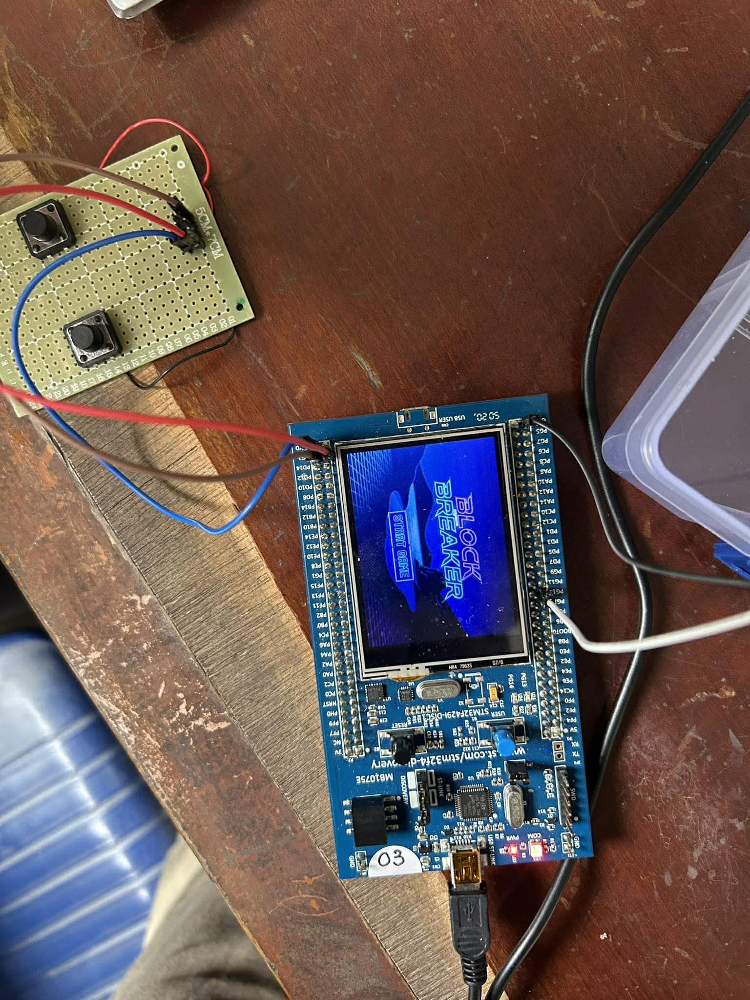
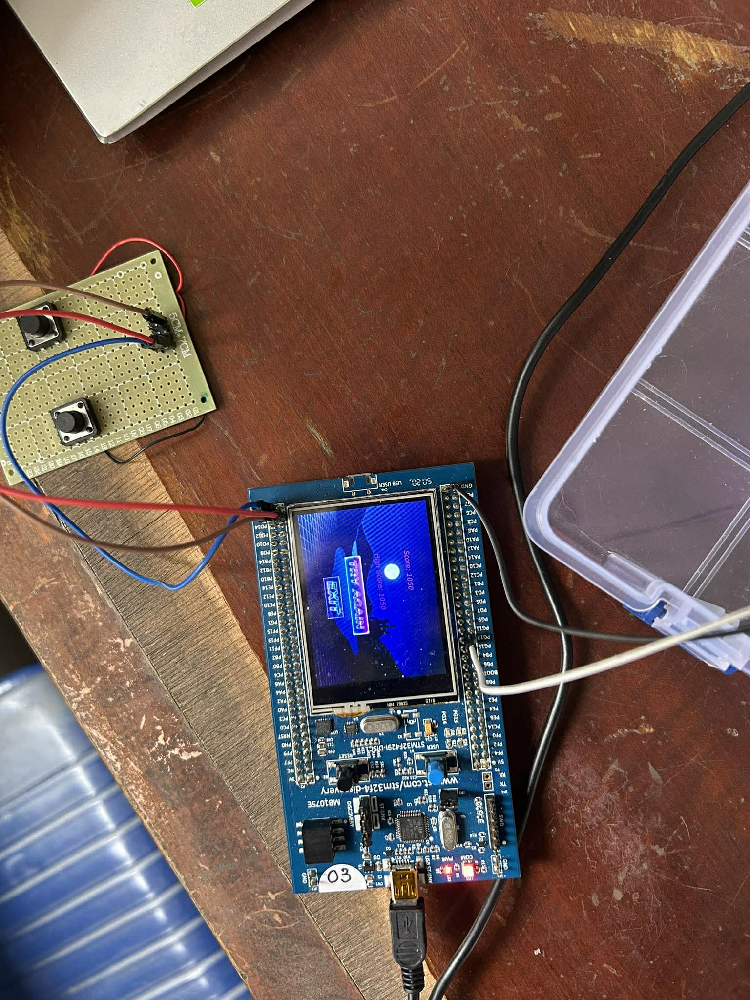

# Block Breaker Game on STM32F429I using TouchGFX

**PROJECT REPORT**

**Lecturer:** Ngô Lam Trung  
**Group:** 7

### Members:

- **Nguyễn Huy Diễn** - Student ID: 20235910
- **Trần Trung Hiếu** - Student ID: 20235934
- **Đặng Ngọc Nam Khánh** - Student ID: 20235954

---

## Contents

1. [I. Introduction](#i-introduction)
2. [II. System Overview](#ii-system-overview)
3. [III. Hardware Design](#iii-hardware-design)
4. [IV. Software Design](#iv-software-design)
5. [V. Conclusion & Future works](#v-conclusion--future-works)

---

## I. Introduction

### 1. Background & Motivation

This project is a group assignment for the Embedded Systems course. It involves the development of a Block Breaker Game on the STM32F429I-DISCOVERY development board. The objective of the project is to demonstrate practical embedded systems programming through the integration of both hardware and software components.

Specifically, the project showcases:

- Real-time graphics rendering using TouchGFX framework
- Hardware interaction with the STM32F429ZIT6 microcontroller
- Touch screen input for game control
- Embedded game development on resource-constrained hardware

### 2. Project Objectives

- Develop a fully functional Block Breaker game on embedded hardware
- Implement touch screen controls for paddle movement using the STM32F429's capacitive touch interface
- Create an engaging user interface with multiple screens (menu, game, game over)
- Demonstrate real-time graphics rendering using the LTDC (LCD-TFT Display Controller) and DMA2D hardware acceleration
- Implement game mechanics including:
  - Ball physics and collision detection
  - Score tracking and high score persistence
  - Power-up system (regain life, lengthen paddle, double ball)

### 3. Project Scope

- The project focuses on single-player gameplay on the STM32F429I-DISCOVERY board
- The game uses the onboard LCD and capacitive touchscreen for display and input
- TouchGFX is used for UI design and screen navigation
- Game logic runs entirely on the STM32F429 microcontroller without external processors

---

## II. System Overview

- **Hardware Layer:** Includes the STM32F429 microcontroller, onboard 2.4" TFT LCD with capacitive touch panel, internal SRAM/Flash, and peripherals such as LTDC (LCD-TFT Display Controller), DMA2D (ChromART Accelerator), and touch controller (via I²C).
- **Middleware & Framework Layer:** Built around TouchGFX, which provides a model-view-presenter (MVP) architecture for graphical user interfaces. TouchGFX leverages hardware acceleration via LTDC for display output and DMA2D for efficient pixel manipulation (e.g., blending, copying). It also abstracts touch input handling through generated HAL (Hardware Abstraction Layer) drivers.
- **Application Layer:** Contains the game logic, including:
  - State management (menu → gameplay → game over)
  - Real-time physics simulation (ball movement, collision detection)
  - Input processing (touch-to-paddle mapping)
  - Game features (score tracking, power-ups, life system)

---

## III. Hardware Design

### 1. Hardware Platform

- **Development Board:** STM32F429I-DISCOVERY
- **Microcontroller:** STM32F429ZIT6
  - Core: ARM Cortex-M4F with FPU (Floating Point Unit)
  - Clock Speed: 180 MHz (with overdrive mode enabled)
  - Flash Memory: 2 MB
  - Internal SRAM: 256 KB
  - External SDRAM: 8 MB (IS42S16400J via FMC)
  - Architecture: 32-bit RISC
  - DSP Instructions: Yes (for graphics operations)

### 2. Display and Touch Interface

The code configures a complex display pipeline to drive the onboard 240x320 LCD:

- **LTDC (LCD-TFT Display Controller):** Manages the timing and signals for the LCD.
- **DMA2D (Chrom-Art Accelerator):** Used to offload graphics operations (like filling or moving pixels) from the CPU to improve performance.
- **FMC (Flexible Memory Controller):** Configured to interface with the external SDRAM, which acts as the frame buffer for the display.
- **SPI5:** Used for communication with the ILI9341 display controller to send initialization commands.

### 3. Peripheral Configuration

- **ADC1 (Analog-to-Digital Converter):** Configured for 12-bit resolution on Channel 13 with a single conversion mode, allowing the system to read analog sensor data with high precision.
- **USART1 (Universal Synchronous Asynchronous Receiver Transmitter):** Set to a baud rate of 115200 with 8 data bits and no parity. This is primarily used for debugging logs and is currently not used.
- **RNG (Random Number Generator):** The hardware RNG unit is enabled to provide true hardware-based random numbers for application logic.
- **GPIO and RTOS Integration:**
  - GPIOG Pins 2 and 3 are configured as inputs with pull-ups to monitor physical "Left" and "Right" user buttons.
  - GPIOG Pin 13 is configured as outputs to create sounds (the associated LED is to confirm whether the buzzer works or not)
  - A CMSIS-OS V2 Message Queue (buttonQueue) is created to allow the background task to send button state updates to the GUI task.
- **System Clock:** The MCU is overclocked to 180 MHz using the High-Speed External (HSE) oscillator and the PLL (Phase-Locked Loop) to provide the processing power required for real-time graphics.

### 4. FreeRTOS Configuration

- **Task 1: defaultTask**
  - **Role:** Monitors the GPIO pins connected to the push buttons (PG2 for Left movement, PG3 for Right movement).
  - **Action:** When a button press is detected, the task packages the input into a single character ('L' for Left or 'R' for Right) and sends it to the message queue.
- **buttonQueue (Intermediate Communication Channel)**
  - Ensures that input events are not lost when the GUI_Task is occupied with intensive graphics rendering. This queue provides a thread-safe communication mechanism, serving as a safer alternative to shared global variables.
- **Task 2: GUI_Task (Main Processing Task)**
  - **Role:** Executes the TouchGFX framework, performs ball physics calculations, and renders the graphical user interface. Execution frequency: Approximately 60 Hz, synchronized with the display refresh rate.
  - **Action:** Invokes the updatePaddle function to check for pending messages in the buttonQueue.
- **Screen1View::updatePaddle (Response Logic)**
  - **Location:** Implemented within the View layer of the TouchGFX application.
  - **Logic flow:**
    1. Checks whether buttonQueue contains any pending messages.
    2. Retrieves the movement command (Left or Right).
    3. Updates the paddleX coordinate accordingly.
    4. Refreshes the visual state of the Paddle widget on the screen.

---

## IV. Software Design

### 1. Development Environment

- STM32CubeIDE 2.0.0
- TouchGFX Designer 4.26.0
- STM32CubeMX
- FreeRTOS
- STM32F4 HAL Driver
- CMSIS

### 2. TouchGFX Architecture (MVP)

#### 2.1. Model

- **Purpose:** Centralized game state management
- **Responsibilities:**
  - Store score and high score
  - Persist game data across screens
  - Notify presenters of state changes

#### 2.2. View

- **Purpose:** UI rendering and user interaction
- **Responsibilities:**
  - Render UI widgets (blocks, ball, paddle, hearts)
  - Handle touch input via message queue
  - Execute game logic (physics, collisions)
  - Trigger screen transitions

#### 2.3. Presenter

- **Purpose:** Mediate between Model and View
- **Responsibilities:**
  - Fetch data from Model for View
  - Update Model based on View events
  - Decouple View from Model

### 3. Screen & UI Design

|             Game Menu             |         In-game Screen          |         Gameover Screen          |
| :-------------------------------: | :-----------------------------: | :------------------------------: |
|  |  |  |

> [!NOTE]
> The images above represent the visual design of the game screens.

### 4. Game Logic & Physics Design

#### 4.1. Core Game Structures

**4.1.1. Ball Structure**
The ball is defined by its x and y coordinates, a radius value (r), and horizontal and vertical velocity components (vx, vy). In addition, maximum and minimum speed limits (MAX_BALL_SPEED and MIN_BALL_SPEED) are enforced to prevent the ball from moving too fast, which would reduce playability, or too slowly, which could lead to a monotonous experience.

**4.1.2. Paddle Structure**
The paddle stores its x and y position, width, height, and movement velocity. It also includes an isExtended state variable to manage paddle expansion when a power-up is collected.

#### 4.2. Physics Engine

**4.2.1. Ball Launch System**
The ball is initialized using a predefined lookup table (launchTable). This approach ensures that the initial launch angle is always valid and avoids degenerate cases such as perfectly vertical or horizontal motion.

**4.2.2. Speed Management**
After each collision, the normalizeSpeed() function is invoked to regulate the ball’s velocity. This function adjusts the horizontal and vertical velocity components so that the overall speed remains constant, resulting in smooth and stable ball trajectories.

The capSpeed() function has three crucial roles:

- **Overall speed limiting (clamping speed):** The system calculates the current ball speed using the pythagorean formula `speed = sqrt(vx * vx + vy * vy)`, implemented via the `isqrt` function (integer square root).
  - If the ball moves too fast (speed > MAX_BALL_SPEED): The game automatically reduces the velocity. This prevents the ball from moving so fast that the graphics hardware cannot keep up or the player cannot react in time.
  - If the ball moves too slowly (speed < MIN_BALL_SPEED): The game increases the ball’s velocity. This ensures the gameplay remains dynamic and does not degrade into an unengaging, overly slow state.
- **Preventing near-horizontal motion (minimum vertical speed):** A common issue in arkanoid-style games occurs when the ball travels almost horizontally (vy close to zero), causing it to bounce indefinitely between the side walls without ever descending toward the paddle. The capSpeed function checks whether `abs(vy)` is below a predefined threshold. If so, it forces `vy` to be at least MIN_BALL_SPEED. This guarantees that the ball always has a meaningful vertical component, ensuring continuous upward or downward motion.
- **Preventing near-vertical motion (minimum horizontal speed):** Conversely, if the ball moves almost vertically (vx close to zero), it also causes troubles. To address this, the function checks whether `abs(vx) < 1`. If this condition is met, it uses `HAL_GetTick() & 1` to introduce a small random horizontal impulse of ±1. This subtle adjustment increases trajectory variation and maintains engaging gameplay.

#### 4.3. Collision Detection

**4.3.1. Wall Collision**
Wall collision handling is straightforward. When the ball reaches the left or right boundary, the horizontal velocity component (vx) is inverted. When the ball reaches the top boundary, the vertical velocity component (vy) is inverted.

**4.3.2. Paddle Collision**
A dynamic bounce angle technique is applied. If the ball strikes the left side of the paddle, it rebounds to the left; if it strikes the right side, it rebounds to the right. The further the collision point is from the paddle’s center, the steeper the resulting reflection angle.

**4.3.3. Block Collision**
Block collision detection is implemented using the axis-aligned bounding box (AABB) algorithm. The system calculates the overlap between the ball and a block to determine the collision direction and update the ball’s velocity accordingly. If the horizontal overlap is smaller than the vertical overlap, the collision is interpreted as a side impact and `vx` is inverted; otherwise, the collision occurs on the top or bottom surface and `vy` is inverted.

#### 4.4. Power-Up System

**4.4.1. Power-Up Spawning**
At the beginning of each level, the STM32 hardware random number generator is used to randomly select a subset of blocks that will contain power-ups.

**4.4.2. Power-Up Falling Animation**
When a block containing a power-up is destroyed, the power-up sprite (heart, arrow or ball) is animated by incrementally increasing its y-coordinate each frame using `moveRelative()`, creating a falling effect.

**4.4.3. Power-Up Effects**

- **Heart:** Increases the player’s life count (lives++).
- **Arrow:** Temporarily increases the paddle width for 6 seconds, with the duration managed using `HAL_GetTick()`.
- **Double Ball:** Activates an additional ball with identical physical properties.

#### 4.5. Game State Management

**4.5.1. Lives System**
The player starts with three lives. Each time a ball falls below the bottom of the screen (y > 320), one life is lost. When all lives are depleted, the game transitions to the Game Over state.

**4.5.2. Round Progression**
The system tracks the number of remaining blocks (countBlocksAlive). When this count reaches zero, a new round is initialized.

**4.5.3. Random Number Generation**
The STM32 hardware RNG is utilized to ensure that gameplay elements, such as power-up placement, are unpredictable, thereby enhancing replayability.

**4.5.4. Sound Effects (GPIO Toggle)**
The buzzer is activated through GPIO toggling to provide audible feedback during game events.

---

## V. Conclusion & Future works

Despite the successful implementation of the Block Breaker game on the STM32F429I-DISCOVERY platform, several limitations were identified. The system exhibits noticeable input latency, which may affect gameplay responsiveness. Audio functionality is minimal and lacks richness, while the fixed display resolution constrains visual scalability across different hardware configurations. Additionally, the use of hardcoded game levels limits flexibility and reduces the potential for dynamic content expansion.

Future enhancements may focus on improving gameplay depth and overall user experience. This includes the introduction of progressive difficulty adjustment to better engage players, the addition of new power-up mechanisms, and the incorporation of particle effects to enhance visual feedback. Furthermore, implementing higher-quality audio would significantly improve immersion and bring the system closer to a more polished and complete gaming experience.

---

## VI. Contribution

### Trần Trung Hiếu

- **Heart Power Up Design**
- **TouchGFX Design**
- **Report Writing**
- **Idea Advisor**
- **Score Calculating**

### Đặng Ngọc Nam Khánh

- **Paddle Expansion Power Up Design**
- **TouchGFX Design**
- **Report Writing**
- **Velocity Bug Fix**

### Nguyễn Huy Diễn

- **Double Ball Power Up Design**
- **Peripheral Configuration**
- **Message Queue Implementation**
- **Main Game Logic Implementation**
- **Code Refactoring**
